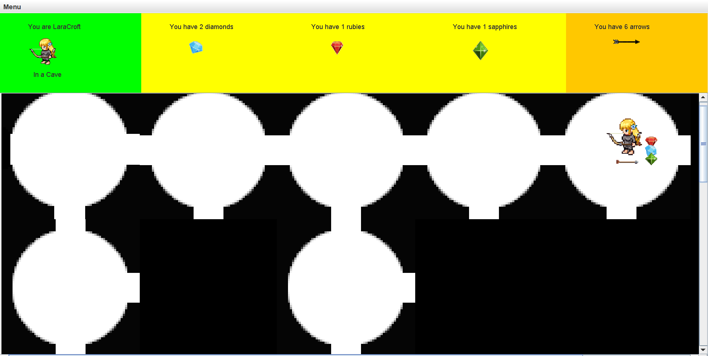
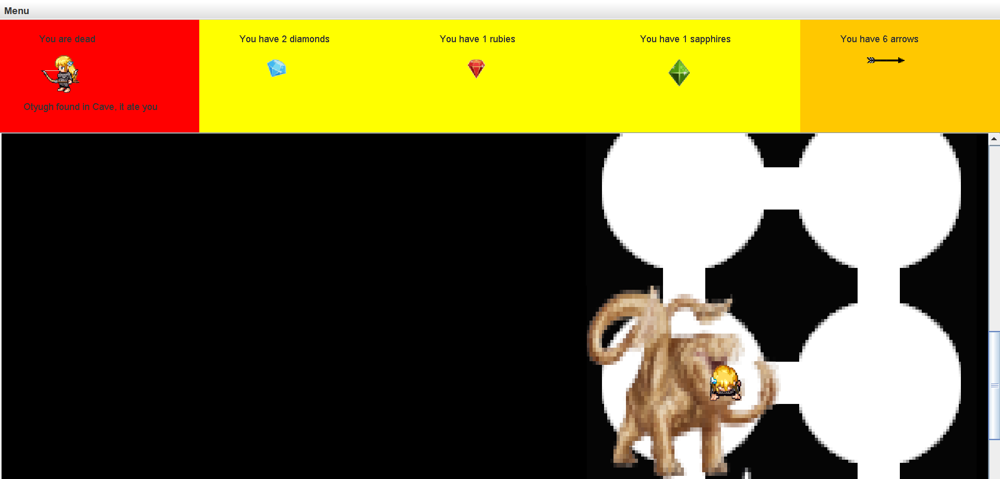
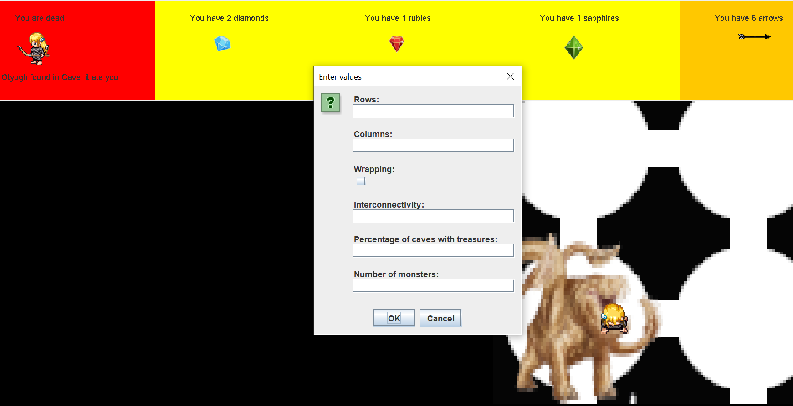
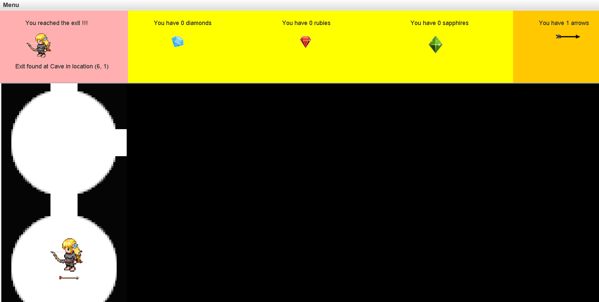

# dungeon
A dungeon game where a player must traverse through the maze, designed using Kruskal's algorithm, to reach the exit in order to win. The obstacles in your way? Monsters and Thieves of course!

## About
- You are in a dungeon of caves (having 1, 3 or 4 exits) and tunnels (having 2 exits).
- You can find arrows and treasures (rubies, diamonds, sapphires) scattered randomly in the dungeon.
- The player starts in a cave and to win, must reach the end cave.
- If you see a faint green mist at your location, an Otyugh is 2 caves away from you.
- If you see a dense green mist at your location, an Otyugh is 1 cave away from you.
- To kill Otyughs, you can shoot crooked arrows to a distance of 5 caves (Tunnels don't count as distance travelled).
- You will also find Thieves at random locations that will rob you of all the treasures you have collected.

## Controls
- Move: Use arrow keys or mouse clicks on valid locations.
- Shoot: Hold 'z' key, an arrow key to indicate direction of shot, and a number key (1-5) and simultaneously release all the keys.
- Pickup items: Press 'p' key.
- 'New Game' option in the Menu will start a game with same settings but game objects and their respective positions randomized.
- 'Restart Game' option in the Menu will start a game with same settings and same positions for game objects.
- 'Change Settings' option in the Menu will allow user to set new game settings, such as number of rows & columns in the dungeon, dunegon node interconnectivity etc.

## How to play?
- Run this command on your Terminal: ```git clone https://github.com/SiddAjriY2Jaccount/dungeon```
- From the root directory, run the command: ```java -jar dungeon.jar```

## Concepts used
- Kruskal's algorithm: For maze construction.
- MVC: Design followed to structure code modules.

## Contributors
[Siddhanth Jayaraj Ajri](https://github.com/SiddAjriY2Jaccount)

## Screenshots



